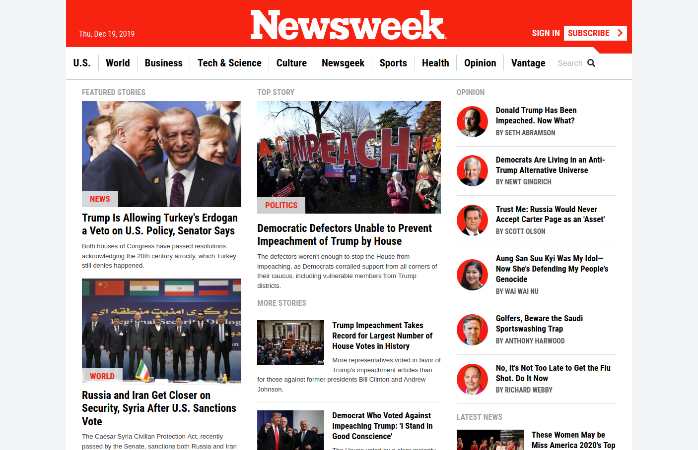

# Using Bootstrap
> This project requests students to build a replica of the news site [Newsweek.com](newsweek.com) using the Bootstrap framework.

## Details
> This page *responsiveness* is ***mobile first***, meaning that the page was designed starting from the smaller possible screen and then grow it up.

### EXTRA SMALL Screen *(< 576px #base)*
#### Navbar
The navbar was made using the corresponding *bootstrap* nav classes and `.fixed-top` to make it stick to the top. The inside is made with a *flexbox* wich aligns everything to the right except the brand logo wich has its own `.mr-auto` to push it to the left.
The actual `<nav>` with the links inside uses `.position-absolute` to push it to the right outside the *viewport* and the menu button takes it inside again. Since we haven't reached the ***Javascript*** `<section>` and I don't know how to use it, I used a ***CSS*** trick for the menu button wich involves using an `<input type="checkbox">` along with a `<label>`; the trick consists on linking the `<input>` and the `<label>` with the `for` attribute and then any styles you put under the *pseudo-class* `:active` will toggle each time you click on the label. This in combination with the `~` selector made possible the functionality of the side navigation.

#### Top articles section
This `<section>` is just a bunch of different `<articles>` and depending of the `<section>` they are from they styles change a little. They all are aligned in one single **column**, however, once the *viewport* gets bigger more **column**s start appearing, therefore I organized the sections inside a ***bootstrap grid*** with three **column**s. In the current *viewport*, however, each **column** takes the full width of the **main** container so they will wrap below each other making it look like one single **column**.

#### In-between sections
Below the top `<articles>` there where a bunch of other `<section>` elements about topics inside the magazine, some *tags* and *slideshows*. They mostly repited the styles from the previous ones so there is not much to say about this beside some of these needed four **column**s instead of three.

#### Featured sections
In here there are some sample `<articles>` of all the faetured sections in the navbar. These `<section>`s are a little trickier than the previous because even if they align in one **column** like the others once the *viewport* changes some of them become **row**s and others stay as **column**s, therefore I wrapped them inside a `
` depending on wheter they align as **row** or not and then align both, the `
` and the `<section>` as columns for this *viewport*.

#### Footer
The last one is the `<footer>`. It only haves two **main** containers inside of it:
- The first one has the brand logo along with a *copyright* anounce and an `<ul>` populated with different social links (facebook, twitter, instagram, tumblr and linkedin). This one only aligns everything in one single **column** to the left.
- The second one has a lot of navigation links inside two different `<ul>` elemnts, the list container just wraps each one of them as the *viewport* gets smaller. However, before the first `<ul>` there is a small text block aligned inline with the list.

### SMALL Screen *(>= 576px)*
#### Whole Page
The only changes in this viewport are the **images** on some articles which have side text, they grow sligthly bigger.

### MEDIUM Screen *(>= 768px)*
#### Top articles section
The three **column**s finally become useful here. First of all the first two **column**s `width` became half of its container fitting both on the same **row** while the third one would still stretch to the full `width` of the second **row**. Then they where reordered (`.order-n`) to put the second **column** to the left and the first one to the right.

#### In-between sections
Here there where some individual changes for each `<section>` so here is a short description about each one of them:
- **In Magazine**: The eight `<articles>` where divide into two rows of four, one above the other, and this layout was kept like this until the end.
- **Editor's Pick**: This one also has eight `<article>`s but in this case they aligned in two **column**s and four **row**s.
- **Featured Slideshow**: This became two **row**s of three `<articles>` for a total of six elements and stays like this until the end as well.

#### Featured sections
These became two **column**s. The content of first one is aligned as a **row** while the second one stays as a **column**. They will keep this layout until the end.

#### Footer
The brand logo container turns into a horizontal *flexbox* and the social links stick to the right. This is the last layout change for this.

### LARGE Screen *(>= 992px)*
#### Navbar
At this point the *fixed* `.navbar` is replaced for a *static* one just at the top of the page (once you scroll down a little the previous `.navbar` will popup). The *static* `navbar` has the navigation links below the `.brand-logo` aligned inline. It will only ocupy the **main** container `width` althought it isn't visible beacause the **main** container still takes the *viewport* full `width`.

#### Top articles section
Here the third **column** will finally align to the side of the other two making the whole **grid** just one **row** high. Since the second **column** changed position with the first one this makes the first **column** to be on the middle.

#### In-between sections
The only section that changed here was the *Editor's Pick* since it went from two columns to four. The other two remained unchanged.

### EXTRA LARGE *(>= 1200px)*
#### Whole Page
The last thing changing here is the **main** container. It will stop growing with the *viewport* and will stick to the *breakpoint* size (`max-width: 1200px`). The extra space will be filled with the margin so the container stays in the middle.

## Built With
- HTML5, CSS
- VSCode

## Live Demo
You can check a live version here:

## Author

👤 **Diego Luna Granados**
- Github: [@SlowKingV](https://github.com/SlowKingV)
- Twitter: [@SlowKingVI](https://twitter.com/SlowKingVI)
- Linkedin: [Diego Luna Granados](https://www.linkedin.com/in/diego-luna-granados-64007b197/)
